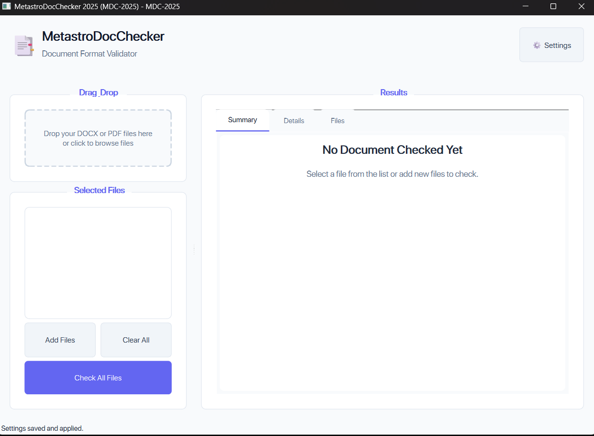

# MetastroDocChecker 2025 (MDC-2025)

A modern document format validation tool for checking DOCX and PDF files against established formatting standards.



## Features

- **Modern UI**: Sleek SaaS-like interface with light and dark themes
- **Document Format Validation**: Ensures documents conform to required format standards
- **Multiple File Types**: Supports both DOCX and PDF formats
- **Batch Processing**: Check multiple files at once
- **Detailed Reports**: Get comprehensive information about document issues
- **Theme Support**: Choose between light, dark, or system default theme

## Installation

### Prerequisites

- Python 3.8 or higher
- PySide6 (Qt for Python)
- Required Python packages

### Setup

1. Clone this repository:
   ```
   git clone https://github.com/yourusername/MDC-2025.git
   cd MDC-2025
   ```

2. Install required packages:
   ```
   pip install -r DocChecker/requirements.txt
   ```

3. Run the application:
   ```
   python DocChecker/src/main.py
   ```

## Usage

1. Launch the application
2. Drag and drop your DOCX or PDF files into the application
3. Click "Check All Files" to validate the documents
4. View the detailed results showing any formatting issues
5. Adjust settings as needed through the Settings menu

## Configuration

The application lets you configure:

- **Font Rules**: Required fonts and sizes
- **Margin Rules**: Expected margin sizes
- **Line Spacing**: Required spacing between lines
- **Interface Settings**: Theme and display options

## Development

### Project Structure

```
MDC-2025/
├── DocChecker/
│   ├── resources/              # Icons, stylesheets, and other resources
│   │   ├── core/               # Core functionality
│   │   ├── ui/                 # User interface components
│   │   └── main.py            # Application entry point
│   └── requirements.txt        # Python dependencies
└── README.md                   # Project documentation
```

### Contributing

1. Fork the repository
2. Create a feature branch: `git checkout -b feature-name`
3. Commit your changes: `git commit -m 'Add some feature'`
4. Push to the branch: `git push origin feature-name`
5. Submit a pull request

## License

This project is licensed under the MIT License - see the [LICENSE](LICENSE) file for details.

## Acknowledgments

- PySide6 for the Qt integration
- The Python community for various libraries used 